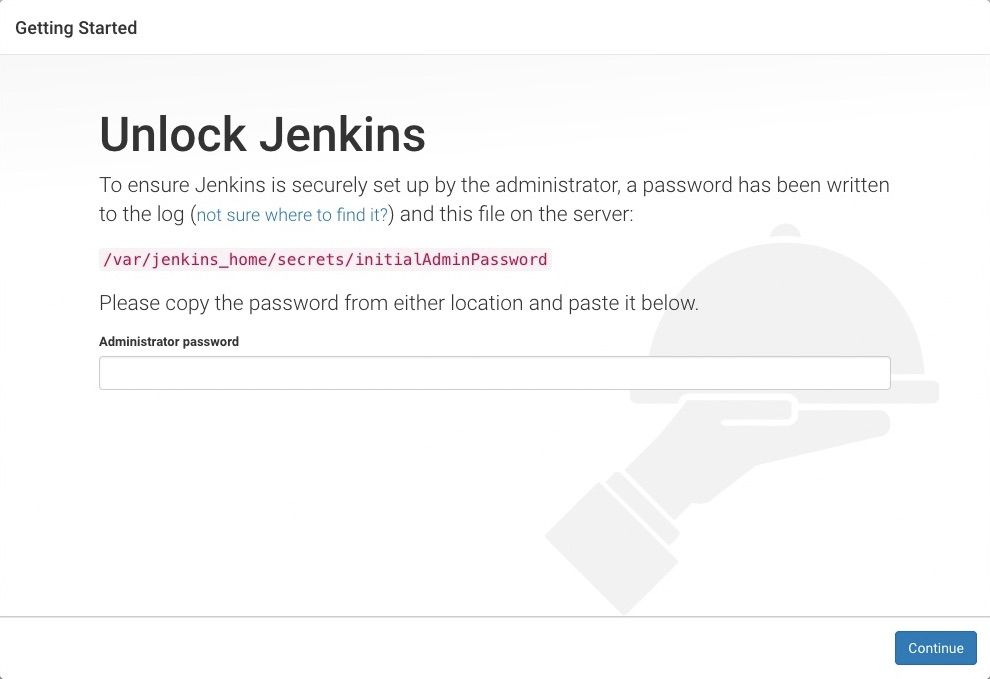
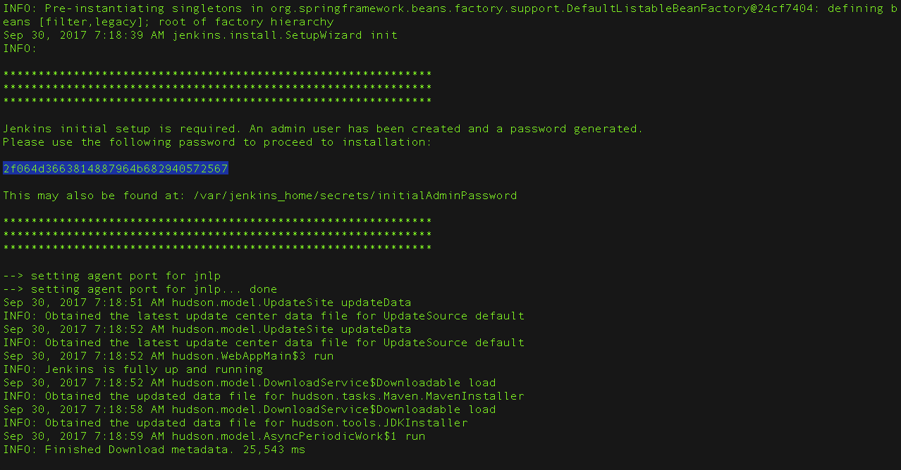
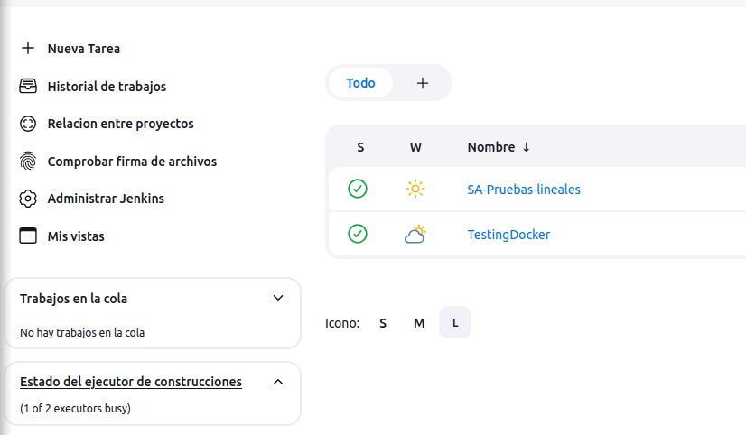
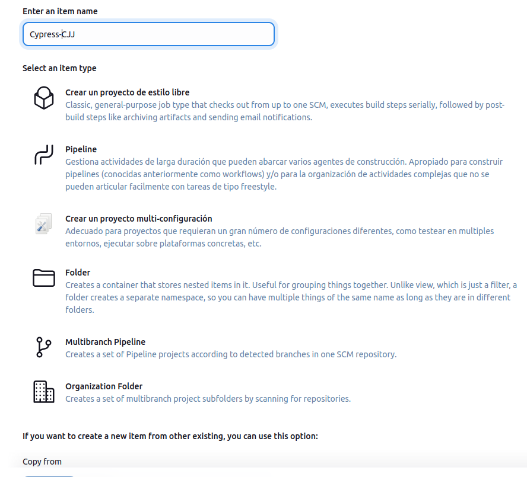
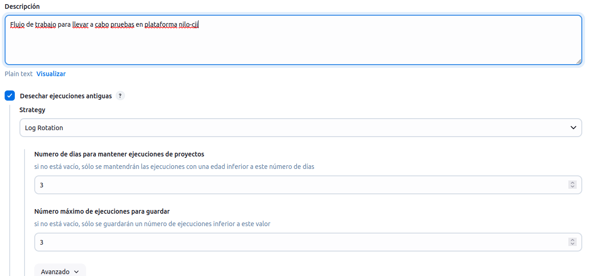
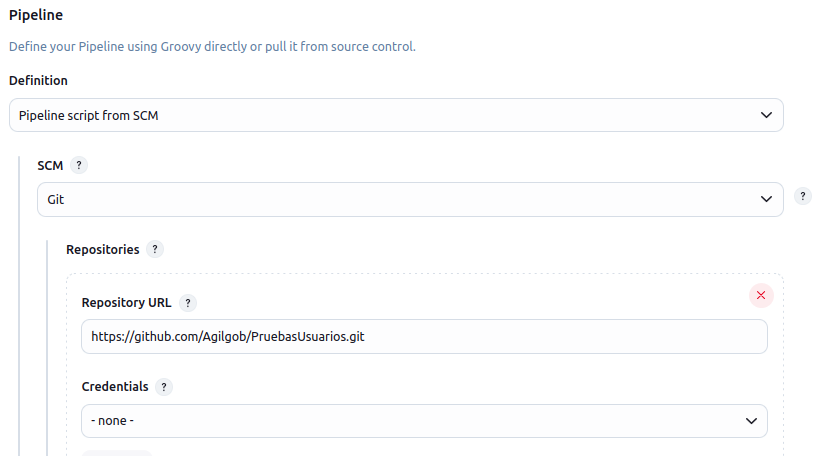
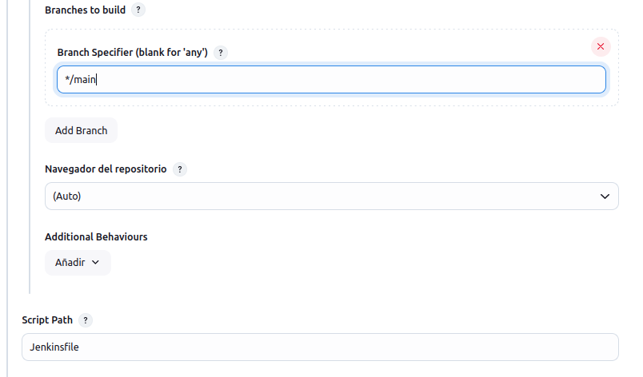

# Proyecto de Pruebas con Cypress

Este proyecto utiliza Cypress para realizar pruebas end-to-end (E2E) automatizadas. A continuación, se describen las configuraciones y variables de entorno utilizadas en el archivo `cypress.config.js`.

### Descripción de las Configuraciones

- **defaultCommandTimeout**: Tiempo de espera predeterminado para los comandos (5000 ms).
- **video**: Habilita la grabación de video durante las pruebas.
- **videoCompression**: Nivel de compresión de los videos grabados (32).
- **videosFolder**: Carpeta donde se almacenan los videos (`tmp`).
- **screenshotsFolder**: Carpeta donde se almacenan las capturas de pantalla (`tmp`).

### Variables de Entorno

- **funcionario**: `secretarioAcuerdos02`
- **ciudadano**: `ciudadanoManuel`
- **tramite**: `promocion_demanda_fam_merc`
- **environment**: `sandbox`

## Ejecución de Pruebas

Las pruebas pueden ser alimentadas por datos de dos origenes distintos, de los archivos fixture que se encuentran en la carpeta `cypress/fixtures` o pueden tomar datos de pruebas realizadas previamente, siempre que las salidas sean compatibles y que se almacenan en el archivo `tmp/testData.json` el cual almacena los datos de pruebas ejecutados anteriormente en un formato muy similar. 

Para ejecutar la prueba usando los datos de fixtures no debe incluirse el parametro `jsonFile` a la ejecucion, opcionalmente puede pasarse las variables de entorno para usar alguno de los objetos en los archivos de fixtures:

Ejemplo:
```bash
npx cypress run --env ciudadano="admin",funcionario="Secretario001",tramite="promocion_demanda_fam_merc" --spec foo
```
Si alguna de estas variables de entorno no se proporciona, se tomarán los valores por defecto declarados en el archivo [cypress.config.js](./cypress.config.js)


Para ejecutar las pruebas tomando los datos almacenados en al archivo `tmp/testData.json`, epecialmente en casos en que se generan datos en pruebas previas, es neceasario usar la variable de entorno `jsonFile=true` como se muestra a continuacion:


```shell
npx cypress run --env jsonFile=true --spec foo
```
En caso de pasar otras variables en el comando, solo se cargan los datos en el archivo `jsonFile` aunque la ejecucion no genera error.


## Estructura del Proyecto

- `cypress/`: Carpeta principal que contiene las pruebas y configuraciones de Cypress.
- `tmp/`: Carpeta donde se almacenan los videos y capturas de pantalla, logs, datos de pruebas (testData.json) generados durante las pruebas.


<details>
<summary><h2>Instalacion</h2></summary>

### Los siguientes pasos son para llevar a cabo la instalacion en sistemas basados en Debian


<details>
<summary><h4>Instalacion JAVA</h4></summary>
Si aun no cuentas con JAVA instalalo usando el siguiente comando

```bash
sudo apt update
sudo apt install fontconfig openjdk-17-jre
java -version
```
</details>


<details>
<summary><h4>Instalacion Node</h4></summary>
Instala Node usando APT package manager


```bash
# Actualiza la lista de paquetes disponibles
sudo apt update

# Instala Node.js
sudo apt install nodejs

# Verifica la versión instalada de Node.js
node -v

# Instala npm (Node Package Manager)
sudo apt install npm
```


</details>


<details>
<summary><h4>Instalacion Jenkins</h4></summary>
Instala Jenkins en su version LTS

```bash
# Agregar la clave y el repositorio de Jenkins
sudo wget -O /usr/share/keyrings/jenkins-keyring.asc \
    https://pkg.jenkins.io/debian-stable/jenkins.io-2023.key
echo "deb [signed-by=/usr/share/keyrings/jenkins-keyring.asc]" \
    https://pkg.jenkins.io/debian-stable binary/ | sudo tee \
    /etc/apt/sources.list.d/jenkins.list > /dev/null

# Actualizar la lista de paquetes e instalar Jenkins
sudo apt-get update
sudo apt-get install jenkins
```

Deshabilita CSP en Jenkins para poder mostrar archivos html en los reportes generados por mochawesome
Con privilegios de super usuario (sudo su) ejecuta los siguientes comandos, no afectan la ejecucion de las pruebas, solo permite ver los reportes en web:

```bash
mkdir -p /usr/share/jenkins/ref/init.groovy.d && \
echo 'System.setProperty("hudson.model.DirectoryBrowserSupport.CSP", "");' > /usr/share/jenkins/ref/init.groovy.d/disable-csp.groovy
```


</details>


<details>
<summary><h4>Configuracion inicial en primer arranque</h4></summary>
Navega a http://localhost:8080 (o el puerto que configuraste para Jenkins durante la instalación) y espera hasta que aparezca la página de Desbloquear Jenkins.



Durante el primer arranque, por consola se muestra el pasword generado automaticamente, usalo para hacer el primer login 



Si por alguna razon no capturaste el password en el primer arranque, puedes consultarlo usando
```bash
sudo cat /var/lib/jenkins/secrets/initialAdminPassword 
```

- Puedes crear un usuario y contraseña o puedes usar las credenciales que se generan por defecto: `admin:admin`.
</details>


<details>
<summary><h4>Configuracion de arranque al cargar el sistema (opcional, recomendado)</h4></summary>


Puedes habilitar el servicio de Jenkins para que se inicie al arrancar el sistema con el comando:

```bash
sudo systemctl enable jenkins
```

Puedes iniciar el servicio de Jenkins con el comando:

```bash
sudo systemctl start jenkins
```

Puedes verificar el estado del servicio de Jenkins usando el comando:

```bash
sudo systemctl status jenkins
```

Si todo se ha configurado correctamente, deberías ver una salida como esta:

```
Loaded: loaded (/lib/systemd/system/jenkins.service; enabled; vendor preset: enabled)
Active: active (running) since Tue 2023-06-22 16:19:01 +03; 4min 57s ago
...
```
</details>

Instala los plugins recomendados por el sistema, espera a que la instalacion se complete.

<details>
<summary><h4>Configuracion del Pipeline</h4></summary>

Crea una nueva tarea 



Asigna un nombre al pipeline y selecciona el tipo 'Pipeline'



Ingresa descripcion y el campo para desechar las ejecuciones antiguas, por ejemplo 2 dias, 2 ejecuciones



Al final del formulario de configuracion selecciona los siguientes valores:
    Pipeline
        Definition : Pipeline script from SCM
        SCM : Git
        Repository URL : `https://github.com/Agilgob/PruebasUsuarios.git`
        Credentials : `- none -` no cambia
        Branch Specifier : `*/main`
        Navegador del repositorio : `(Auto)` no cambia
        Script Path : `Docker/Jenkins/Pipelines/Jenkinsfile_fn`




</details>


</details>
Este es un cambio menor para probar el trigger :)