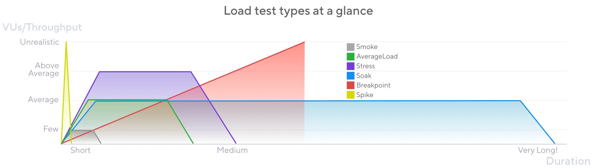

# Detalles de los archivos de configuracion y tipos de prueba.

### Smoke Tests (Pruebas de humo)

    Validan que el script esté bien escrito y que el sistema responda correctamente ante una carga mínima.

    Estas pruebas pueden llevarse a cabo solo para validar que la aplicacion esta desplegada correctamente.

    Útiles como primera validación en pipelines de CI/CD. Si esta prueba falla, no tiene sentido avanzar con cargas mayores.

### Average Load Tests (Pruebas de carga promedio)

    Evalúan cómo se comporta el sistema bajo condiciones normales y esperadas de uso.

    Simulan tráfico constante, como el que recibiría un sistema en un día típico de producción.

### Stress Tests (Pruebas de estrés)

    Evalúan el comportamiento del sistema cuando la carga supera su capacidad promedio esperada.

    Se busca identificar cuándo y cómo falla el sistema, para anticipar cuellos de botella o límites técnicos.

    Una forma comun de probar el estres es medir el uso promedio y en la prueba, sumularlo a un 150% - 200% del uso promedio. (o mas, segun se planifique)

### Soak Tests (Pruebas de absorción o duración prolongada)

    Ponen a prueba la estabilidad del sistema durante largos periodos, manteniendo una carga constante o variable durante horas.

    Útiles para detectar fugas de memoria, acumulación de errores o degradación del rendimiento con el tiempo.

### Spike Tests (Pruebas de picos)

    Simulan aumentos repentinos e intensos de tráfico, seguidos de una caída rápida.

    Evalúan si el sistema resiste eventos inesperados como un anuncio viral, un reinicio masivo de sesión o una sobrecarga puntual. 

### Breakpoint Tests (Pruebas de punto de ruptura)

    Incrementan gradualmente la carga hasta que el sistema ya no puede responder correctamente.

    Su objetivo es identificar la capacidad máxima real del sistema antes de fallar.

    Se debe tener en consideracion, que pruebas como esta, se llevan a cabo en casos especificos y fuera del horario de uso ya que se busca encontrar el punto de quiebre, por lo que la prueba deberia ser detenida hasta que la aplicacion colapse o falle constantemente. 

La informacion fue recuperada de la pagina de [grafana/k6](https://grafana.com/docs/k6/latest/testing-guides/test-types/)